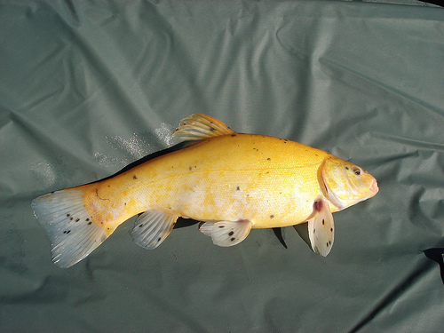

# Test samples
All images are taken from the dataset ImageNet [1].

**Sample #1** (fish.jpeg):  

**Sample #2** (Walking_tiger_female.jpg): 

## References:
[1]	O. Russakovsky et al., “[ImageNet Large Scale Visual Recognition Challenge](https://arxiv.org/abs/1409.0575),” International Journal of Computer Vision (IJCV), vol. 115, no. 3, pp. 211–252, 2015, doi: 10.1007/s11263-015-0816-y.
